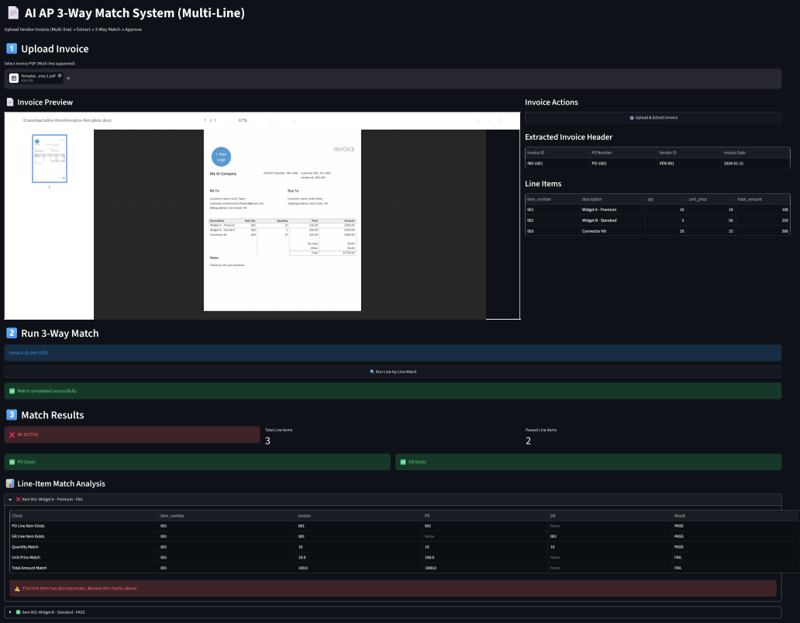

# AI---Automated-AP-Invoice-Processing-
AI-powered Accounts Payable 3-way matching system using FastAPI, Streamlit, SQL, and OpenAI OCR

This is already a **very strong architecture doc** — now I’ll convert it into a **high-impact GitHub README** that looks like a **real enterprise-grade project (SAP-style + AI automation)**.

You can copy-paste this directly into `README.md`.

---

# 🚀 FINAL POLISHED README (PRODUCTION GRADE)

```md
# 📄 AI-Powered Accounts Payable Invoice Processing System

## 🚀 Overview

This project is an **enterprise-grade Accounts Payable (AP) automation system** that replicates SAP-style invoice processing using:

- 🤖 AI-based invoice extraction (OpenAI)
- 📄 PDF ingestion pipeline
- 🗄️ SQL-based staging architecture
- 🔗 Multi-line 3-way matching (Invoice vs PO vs GR)
- ✅ Approval workflow system

It is designed to simulate **real-world ERP/AP automation systems** used in enterprise finance operations.

---

## 🧠 Key Capabilities

- 📥 Upload vendor invoices (PDF)
- 🤖 Extract structured invoice data using AI (multi-line support)
- 🧾 Store data in staging tables (header + line items)
- 🔗 Perform SAP-style 3-way match at **line-item level**
- ⚠️ Handle exceptions:
  - Missing GR → HOLD
  - Price mismatch → REJECT
  - Quantity mismatch → REJECT
- ✅ Approve and move to final table
- 📊 Visual dashboard for reconciliation results

---

## 🏗️ System Architecture

```

Frontend (Streamlit)
↓
FastAPI Backend
↓
AI Extraction Layer (OpenAI + OCR)
↓
Staging Database Layer
↓
3-Way Match Engine
↓
Final Approval Workflow

```

---

## 🔄 End-to-End Data Flow

```

Invoice PDF Upload
↓
Extract Text (PyMuPDF)
↓
AI Parsing (OpenAI GPT)
↓
Structured JSON Output
↓
Insert into Staging Tables:
- invoice_staging
- invoice_line_items_staging
↓
Fetch PO + GR from DB
↓
Run Line-Level 3-Way Match
↓
Generate Match Results (PASS/FAIL)
↓
Approve → Move to Final Tables

````

---

## 🗄️ Database Design

### 📌 Core Tables

- `invoice_staging`
- `invoice_line_items_staging`
- `po_staging`
- `po_line_items`
- `goods_receipts`
- `invoice_final`
- `invoice_line_items_final`
- `audit_log`

---

## 🔗 Line Item 3-Way Matching Logic

Each invoice line item is validated against PO and GR:

### Checks Per Line Item:

- PO Line Exists
- GR Line Exists
- Quantity Match
- Unit Price Match
- Total Amount Match

### Example:

| Item | Invoice Qty | PO Qty | GR Qty | Result |
|------|------------|--------|--------|--------|
| 001  | 10         | 10     | 10     | PASS   |
| 002  | 5          | 5      | 4      | FAIL   |

---

## ⚙️ Tech Stack

- **Backend:** FastAPI
- **Frontend:** Streamlit
- **Database:** SQLite / PostgreSQL
- **ORM:** SQLAlchemy
- **AI Engine:** OpenAI GPT
- **PDF Parsing:** PyMuPDF
- **Data Processing:** Pandas

---

## ▶️ How to Run

### 1. Install dependencies
```bash
pip install -r requirements.txt
````

---

### 2. Initialize database

```bash
python -m backend.init_db
```

---

### 3. Seed sample data

```bash
python -m backend.seed_data
```

---

### 4. Start backend

```bash
uvicorn backend.main:app --reload
```

---

### 5. Start frontend

```bash
streamlit run frontend/app.py
```

---

## 📡 API Endpoints

| Method | Endpoint                | Description        |
| ------ | ----------------------- | ------------------ |
| POST   | `/upload`               | Upload invoice PDF |
| POST   | `/match/{invoice_id}`   | Run 3-way match    |
| POST   | `/approve/{invoice_id}` | Approve invoice    |

---

## 📊 Sample Match Output

| Item | Invoice | PO | GR | Result |
| ---- | ------- | -- | -- | ------ |
| 001  | 10      | 10 | 10 | PASS   |
| 002  | 5       | 5  | 4  | FAIL   |

---

## 🧠 Business Logic

* Line-item level validation (SAP-style)
* Strict 3-way reconciliation
* Auto HOLD for missing GR
* Auto REJECT for mismatches
* APPROVAL moves data to final table

---

## 🏢 Real-World Mapping

This system mimics:

* SAP MM (Materials Management)
* SAP FI-AP (Accounts Payable)
* Oracle Financials
* Coupa / Ariba workflows


## 📸 Screenshots





---

## 🏆 Project Highlights

* ✔ Multi-line invoice processing
* ✔ Enterprise-grade staging architecture
* ✔ SAP-style 3-way matching engine
* ✔ AI-powered extraction pipeline
* ✔ Production-style FastAPI backend
* ✔ Interactive Streamlit UI

---
```
